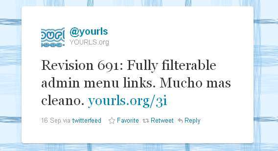
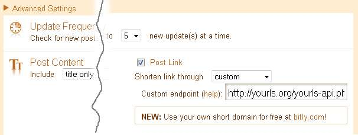

For many, [Twitterfeed](http://twitterfeed.com/) means you have to use bitly. See, it is very easy to set up Twitterfeed to use your own YOURLS install and effortlessly publish tweets from a custom RSS feed using your own URL shortener. For instance, I do this on the [@yourls](https://twitter.com/#!/yourls "@yourls") account, where every source commit on the project gets tweeted.
<!-- truncate -->

\[caption id="attachment\_137" align="aligncenter" width="568" caption="Twitterfeed + custom URL shortener"\]\[/caption\]

To do so, create a new feed on Twitterfeed, and in the Advanced Settings, check "Post Link" and pick "Custom" as "Shorten link through" option. You'll be given an input field to define your "Custom endpoint". In this field, enter the URL of your YOURLS API, like so:

`**http://sho.rt/**yourls-api.php?**signature=123456**&action=shorturl&format=simple&**url=%@**`

The important bits in this URL endpoint are:

- the URL of your YOURLS API, obviously
- your own [secret signature](http://yourls.org/passwordlessapi "YOURLS Passwordless Authentication")
- `url=%@`, because Twitterfeed will replace "%@" with the URL to shorten

\[caption id="attachment\_139" align="aligncenter" width="606" caption="Twitterfeed Advanced Settings"\]\[/caption\]

Have fun!
