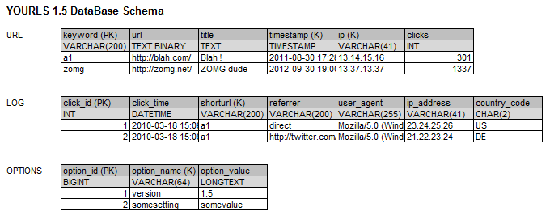
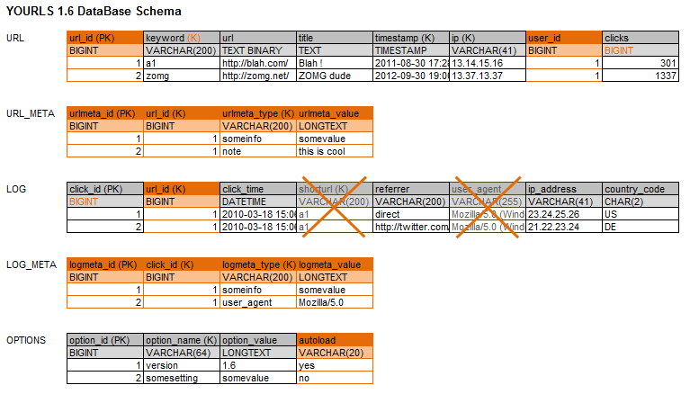

What's up, gents? I've begun working on the next iteration and here's what I'm up to.

<!-- truncate -->

## YOURLS 1.5 : DB suckage

As everybody knows, the current database design in YOURLS is dumb and very inefficient. Its biggest flaw is that the keyword (_ie_ short url) is repeated in both the `URL` and the `LOG` tables, making it absurdly difficult to update a short url without losing all historical data.

Another design decision I regret was to store stuff in case they would be useful to anyone, such as user agents in the log table. Since there's no core feature using that info and I probably won't implement any, this should not be there. There's a plugin API for this.

There are a couple of awesome features I want to work on for YOURLS 1.6, one of them being the ability to store arbitrary data associated to any short URL -- think _url meta data_, the way WordPress does it.

## YOURLS 1.6 : previous thoughts

I've been pondering about the next DB schema for a _very_ long time now, trying to think about the most state-of-the-art structure I could come up with (given my overall blatant lack of skill for DB things) and addressing all possible future features and current issues. I've [proposed stuff](http://code.google.com/p/yourls/wiki/DatabaseStructure) and a few people have been kind enough to comment. But all this had one weakness : it was complicated and scaring me. Seriously :)

## YOURLS 1.6 : smarter yet simple (at least I hope so)

I decided to make up my mind once for good and here is how I see things in YOURLS 1.6: 

The main `URL` table will be properly [normalized](http://en.wikipedia.org/wiki/Database_normalization) with a URL id to stop repeating the keyword across tables. I could probably go further in normalization (storing the long URL and title somewhere else, as I [first thought](http://code.google.com/p/yourls/wiki/DatabaseStructure)) but that's where I think it becomes too much trouble and hassle for too few benefits.

The `URL_META` table will store anything you'd like about a particular short URL and will be used by plugins: some tags, a note, a mime type to handle redirection differently, anything.

The `LOG` table will be trimmed down a bit, which -- disk wise -- should be beneficial to sites with lots of hits, and properly. Again here I could probably go further and normalize the referrer information, but what bothers me then is the number of DB queries needed for each short URL redirection, which I want to keep at a very minimum.

The `LOG_META` table, just as its meta sibling, will store anything you'll want to store about a hit: the user agent, some cookie info, anything.

No big change in the `OPTIONS` table, just an `autoload` parameter so plugins will be able to store anything without loading that every time in RAM.

So, that's it. If you have any thought or any "zomg dude don't, terrible decision" warning to share, please do. We'll see later for other DB novelties such as log archives or further optimization. I'd rather stop pondering and start coding :)
