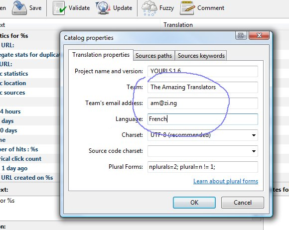
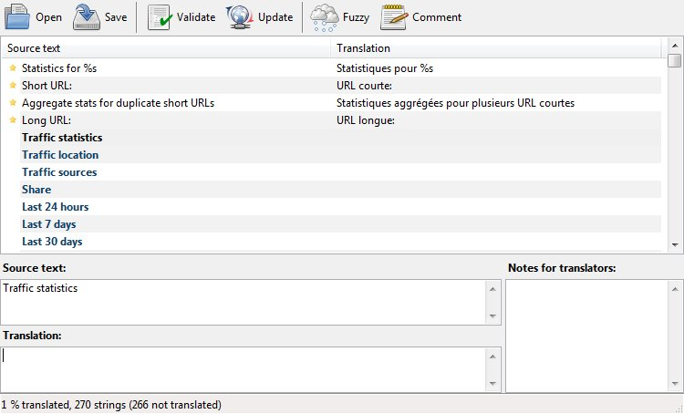
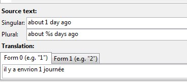
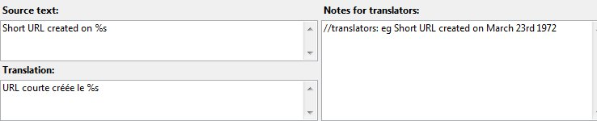

Since version 1.6 YOURLS is fully "localizable", ie translatable, and the translation process itself is very simple. We're going to create a translation file, but first, a very little theory.

<!--truncate-->

## A… "locale" ?

The default language of YOURLS is U.S. English (or, to be accurate and fair, it's "Ozh English" : it's not my mother tongue so a few sentences may be sometimes a bit _le suck_ ; if so please correct me :)

In nerd speak, that language is called a "locale" : a combination of language (English) and regional dialect (US, you know, _colors_ and _colours_). Hence, the default locale of YOURLS is **en_US**.

YOURLS uses translation files that contain the strings in English and in their translated form. There are 2 files: a **PO** file, which is human readable, and a **MO** file, which needs to be generated by a script or software.

In this example, I'll show you how to generate a translation for France's French (ie `fr_FR`) using [Poedit](https://poedit.net/), a simple PO file editor, but everything will be very similar using another desktop tool or web based tool such a [Loco](https://localise.biz/free/poeditor).

## Generate your translation file

1. Install [Poedit](https://poedit.net/). Small download, simple install, no configuration, cross platform, free.
2. Download the [YOURLS.pot](https://github.com/YOURLS/YOURLS.pot) template file, rename it to `fr_FR.po`
3. Open your `fr_FR.po` with Poedit
4. Optional : fill in some translation details. To do so: click Catalogue / Properties. Leave other fields untouched, you don't need them.

   

5. Start translating. It's really just about entering translated text in the **Translation** field. Be sure to copy any HTML tag, punctuation or seemingly cryptic bits such as `%s` that will be replaced within YOURLS by non translatable text (a URL for instance).

   

6. Once you're done, save your work: Poedit will save your modified` fr_FR.po` file, which is the human readable translation file, and will generate a `fr_FR.mo` file, a machine readable file and what YOURLS need to translate strings.

YOURLS 1.6 contains about 270 translatable strings. Some are very short (one or a couple of words), some a longer sentences, but overall the process isn't too long or cumbersome. As an example, creating the complete French translation, fine tuning it (and fixing a couple YOURLS bugs by the way) then creating a [repository to host the files](https://github.com/ozh/YOURLS-fr_FR) took me roughly 75 minutes.

## Check and fine tune your translation file

Test your file to check translations perfectly fit the context they are used in:

1. in your `config.php`, add or edit the following:
   `define( 'YOURLS_LANG', 'fr_FR' );`
2. drop the two PO and MO files in `user/languages`
3. Play with YOURLS and check all pages and possible uses (shorten link, edit and delete stuff, etc.)

## Distribute your files

Last step: make sure others can benefit from you hard work!

1. Upload your two PO and MO files somewhere on the interweb. I recommend using a source controlled service, such as [GitHub](https://github.com/): this will make your changes easy to track, your files easy to maintain, and others' contributions easy to implement. If you don't want to use Git, a regular hosting (your blog) will be fine

2. Ping us! Open a pull request on https://github.com/YOURLS/awesome-yourls and tell us where your translation lives (see [examples](https://github.com/YOURLS/awesome/pulls?q=is%3Apr+translation+))

## Protips: what makes a good translation ?

**Be fluent** 
To be a good translator, you need to be very comfortable with English and the language you'll translate to. Casual knowledge of one or both will result in a translation that will most likely sound awkward or unnatural to native speakers. In other words: [this](https://www.youtube.com/watch?v=HbvYeLxMKN8).

**Don't translate literally**
Maybe the English sentence will have a 2 part structure that won't sound natural in your language, maybe a longer sentence or 3 smaller sentences will sound better. Adapt, refine, make it sound natural.

**Keep the same tone** 
Some messages are very formal (eg "URL invalid" as an operation result) and some are less formal. Keep the same level of formality or informality, as it depends on the context in which string will be used.

**Don't over translate** 
Some English words have become common enough that it may sound weird to translate them. For instance, it's up to you to determine if "**plugin**" or "**bookmarklet**" have to be translated or if those words are better as is.

## Bonus: Protips using Poedit

Hitting `Control + Enter` or `Control + Down arrow` will navigate to the next untranslated string. Hitting `Control B` will copy the source (untranslated) text to the Translation box, which can be handy if you have a few HTML tags to re-use.

Sometimes the **Translation** field will show a split field: it means you need to enter the singular and plural form of a sentence.

Sometimes you will also get a few hints in the **Notes for translators** area: these comments will help you understand the context of a string and help you pick the best translation.

