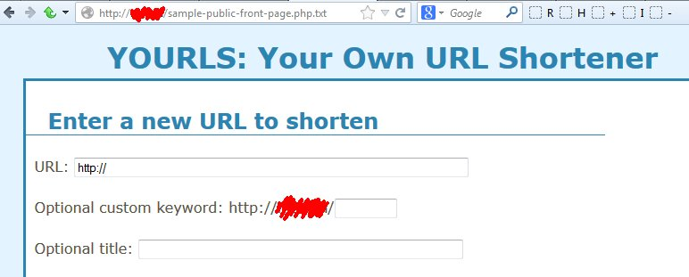

I regularly get reports or call for helps about YOURLS installs that are flooded with spam links despite being configured as private (ie constant [`YOURLS_PRIVATE`](http://yourls.org/#Config) set to `true`, as 99% of installs should have)

In 9 cases out of 10, the "problem" is that the user also has set up an unprotected public interface through which anyone can shorten links. Seriously. [PEBKAC](http://en.wiktionary.org/wiki/PEBCAK), really.
<!-- truncate -->

But a kind and smart user also [brought to my attention](http://code.google.com/p/yourls/issues/detail?id=1319) a (stupid) server default config that can make your YOURLS install spamable: on some machines, `filename.php.txt` is interpreted as a PHP file instead of a text file.

In other words, when loading `sample-public-front-page.php.txt` in your browser, instead of seeing [code in a text file](http://yourls.org/sample-public-front-page.php.txt), you might see this:

Check right now that your server is properly configured. If that's not the case, delete or rename those \*.php.txt files and poke your server admins because I'm pretty sure that's not how a web server is supposed to run.

Note: if you're purposely running a public YOURLS install and you are getting spam, that is another matter. There are numerous [anti spam plugins](http://code.google.com/p/yourls/wiki/PluginList) for YOURLS. Use them.
