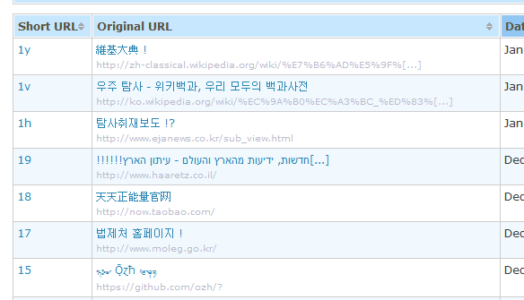

As you may know, [YOURLS 1.7](https://github.com/YOURLS/YOURLS/releases) was released a couple days ago ([announcement](http://ozh.dreamhosters.com/2014/01/yourls-1-7-tom-araya-released/)). I promised a few blog posts highlighting the goodness and new features this version brings, so let's get started.

Besides better protection against potential SQL injection attacks and overall security measures, what's new in YOURLS 1.7?

<!-- truncate -->

## Better HTTP requests handling

Instead of a half-baked home-grown set of functions to perform HTTP requests, YOURLS is now using the awesome PHP library [Requests](https://github.com/rmccue/Requests).

"Yeah, err, probably cool", you're thinking, "but how exactly is that useful for me?" I hear you, let me elaborate.

## Proxy support

The first direct benefit for you, kind user, is that YOURLS is now proxy-compatible, and you can install it behind a proxy or firewall. The will primarily interest corporate users or anyone setting up a YOURLS shortener in a corporate environment. If you're into this, be sure to check the documentation: [YOURLS proxy support](https://github.com/YOURLS/YOURLS/wiki/Proxy-Support).

By the way, this is an excellent example of how open source projects can cross-pollinate each others. Requests is an excellent library I wanted to use, I [contributed](https://github.com/rmccue/Requests/blob/master/CHANGELOG.md#160) to it to add proxy support, and now it powers the inners of YOURLS.

## Better support for UTF8 titles

There's a more direct benefit for the masses of that HTTP request handling improvement. Now, YOURLS should more reliably fetch titles from pages you're shortening, no matter how ẘεḯґ∂ and ḟüᾔḱƴ character set they're using.

This should work better than ever, with most combination of charsets, as declared by HTML pages or by server header.

## Interactions with `api.yourls.org`

And that is the one feature I'm particularly in love with. It's so neat, it deserves its own blog post. Next time!
