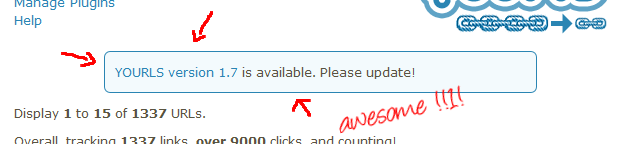

In case you missed it earlier: [YOURLS 1.7](https://github.com/YOURLS/YOURLS/releases) is out, and I've started a series of posts explaining why it's twice greater than the Great Wall of China.

Previous posts explained how protecting against SQL injections is cool, and how better HTTP requests are neat. Today, let's discuss how awesome it is to chit chat with `https://api.yourls.org`.

<!-- truncate -->

## "Update, dude"

One image is better than 1000 words, they say, so here's one image:

This is what you'll see now when there's a new version of YOURLS and you're missing the party. That, my dear estimated YOURLS user and fan, is awesome. Since we're now sure you won't be missing the next update, we'll be much less reluctant to push a X.Y.1 release when we've fixed a tiny annoying bug.

Your own YOURLS setup will be now chatting with the mothership (aka `api.yourls.org`) when it gets bored, and telling you about a new version as soon as it is available is only the visible part of the feature.

## YOURLS phone home

Just like [E.T.](https://www.youtube.com/watch?v=iyFijjikkeM "Man, this movie is 30 YEAR OLD, none of your readers has seen it!"), YOURLS will now phone home. What does that mean exactly?

It means that your YOURLS setup will, along with checking once in a while if there's a new version, send a few stats to the mothership to help us understand how you have installed YOURLS and how we can improve things in the future. These stats will provide us **tremendously useful** insights and facts, and I'm not overstating this.

At the moment, several stats are collected, and this number will most likely decrease with every new version. Only a few hundred installs have checked in, and things will widely change as many more install YOURLS, but here are the current trends:

- Less than 9% of you are running **PHP 5.2**. This is very good news, because we want to drop PHP 5.2 support as soon as possible, and a huge surprise when compared to the [whole internet](https://w3techs.com/technologies/details/pl-php/5/all) or to what [WordPress users](https://wordpress.org/about/stats/) are running (I'm expecting this share to go way up as more update their install, though)
- 96% have **MySQLi** installed, 95% have **PDO**. I'm very surprised and I'm not sure what to think, since I was expecting no less than 100% here.
- Two thirds of you don't use any **plugin**. It _might_ be an indication that YOURLS could be streamlined and go on a quick diet to move a few core features into [YOURLS plugins](https://yourls.org/pluginlist). Or maybe it just means that 66% of you just find it perfect as it is.
- 90% use the default English **locale**. I think this shows we're not promoting enough the existence of [translations for YOURLS](https://yourls.org/translations), in your language. Si. Da. Oui.
- The average **domain length** running YOURLS is 11.8 characters, shortest being 5 (xx dot xx), longest being 55 and a proof that some of you are running YOURLS with completely unexpected use case (I mean, I would have imagined the whole point of running a URL _shortener_ would be to run it off something already _short_, right?)
- 51% of you have more than 1 user defined, so they're obviously a need for **user management**, and this will help us eventually prioritize that feature

## Future stuff from the mothership

At the moment, [checking for a new version](https://api.yourls.org/core/version/1.0/) is the main job of the API server. There are a few [other API available](https://api.yourls.org/doc), and the list will grow with more services, the obvious one being to check for plugin updates.

Feel free to use these API in your scripts and apps, and if you have any question about usage or any issue with using it, [open an issue here](https://github.com/YOURLS/api.yourls.org).

## Thank you for your cooperation !

From now on, an easy way to contribute to YOURLS is to simply run YOURLS, since, doing so, you're sending these stats that will help us make good design decisions in the future.

I can't express it enough: this will be tremendously useful for us.

Nothing sensitive is sent (no login, no password, no cookie key) and, of course, everything collected shall be made public, for everyone's benefit. Once we have enough stats to make numbers a bit more reliable (a couple thousands I'd say), we'll figure a way to share them, probably on [yourls.org](https://yourls.org/).

## But, you know, privacy!?

No sweat, we got you covered.

We know some of you just don't like to report anything about their install, because they're working on a super top secret project, or because they're high profile military spies, or because they're just folks with no other valid reason that they want to do it.

If you want your YOURLS install to skip phoning home, just add the following line at the end of your `config.php`:

`define( 'YOURLS_NO_VERSION_CHECK', true );`

No more checking for new version, no more sending super secret stats. Please do this only if you believe you have a reason to do this, as we'd rather have your stats in: the more we get, the more we can make out of it.

That's it for today's highlight! Next time, next cool feature: username encryption!
