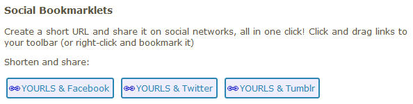

Last post in our series "What's cool with [YOURLS 1.7](https://github.com/YOURLS/YOURLS/releases)" -- be sure to check previous posts dealing with SQL injections, security matters, HTTP improvements and other important subjects.

Today we'll discuss about being social.

<!-- truncate -->

## Social Bookmarklets

Bookmarklets have been polished and you have now 3 more to use. Head to the **Tools** page of your YOURLS install and you will discover these new buttons:

These bookmarklets will allow you to shorten a URL and share that short URL to Twitter, Facebook or Tumblr, all in one click. For extra goodness, you can also select text on the page you're shortening before clicking the bookmarklet, and if the social site allows it, that text will serve as a highlight for your shared bit. Try it!

Oh, and of course, if you share links on social networks this way, be sure to tell your friends about YOURLS! :)

## Happy shortening !

This ends the tour of new features in YOURLS 1.7. Have fun using it, shorten URLs like it's your birthday, [star the project](https://github.com/YOURLS/YOURLS) on Github, follow [@yourls](http://twitter.com/yourls) for general YOURLS news and tell your friends about it.

<iframe src="http://ghbtns.com/github-btn.html?user=yourls&amp;repo=yourls&amp;type=watch&amp;count=true&amp;size=large" allowtransparency="true" frameborder="0" scrolling="0" width="170" height="30"></iframe>

Depending on feedback we may release a 1.7.1 if and when we feel it's necessary. The next batch of features that will make it into 1.8 and 2.0 are currently being under development and, as usual, there is \*no ETA\* :)

Cheers!
