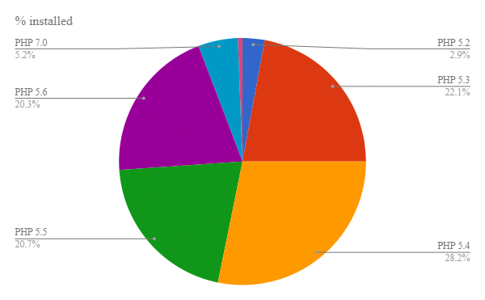

Hello World! I've had some free time recently to devote to your favorite URL shortener, and as a result the latest is now [YOURLS 1.7.2](https://github.com/YOURLS/YOURLS/releases/tag/1.7.2). Update now and be sure your friends update too!

<!--truncate-->

## What's new?

This is a bugfix lil' release and you will probably won't notice much if you don't inspect under the hood. For those interested of course the [changelog](https://github.com/YOURLS/YOURLS/releases/tag/1.7.2) keeps track of everything that has been improved, added or fixed.

The only real "major" news is that PHP 5.2 support is officially dropped. To be honest it's been unofficially supported for quite some time now, and if you still happen to run PHP 5.2 and YOURLS works on it, cool for you, but it should be definitely broken on your side from now on. For the record, as of today less than 2.9% of all YOURLS installs still run on 5.2, while 22% are on 5.3, 28% on 5.4, 20% on 5.5, 20% on 5.6 -- as you can see this is pretty even -- and just above 5% of you folks running PHP 7+. Yes, in case you were unaware, [YOURLS is running fine on PHP 7+](https://github.com/YOURLS/YOURLS/actions).

## How to update?

Same business as usual. Simply download the archive and overwrite all existing files. While you're at it, why don't you backup your database data? I'm sure it's been a while already since last time 🙂

Update and tell your friends and family to update too!
