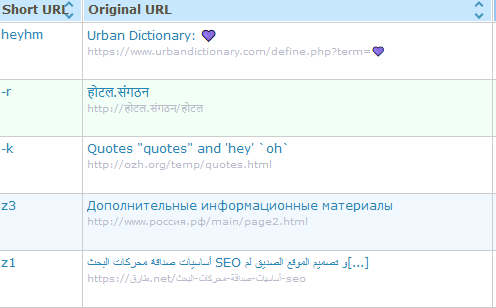

It is with great pleasure and excitement that I announce the release of [YOURLS 1.8 "Mike Muir"](https://github.com/YOURLS/YOURLS/releases/1.8)!

<!--truncate-->

## Hail Mike Muir 🤘❤️

First things first, in our now secular tradition to name YOURLS releases after a infamous metal vocalist, I'm dedicating this release to **Mike Muir**, cyco frontman from the sublime thrash punk band we all mosh to, Suicidal Tendencies. Damn I love this man. I suggest you tune in [some relaxing music](https://www.youtube.com/watch?v=nxcJW6bs5os) while reading the rest of this post and updating YOURLS.

> [Mike Muir](https://www.flickr.com/photos/orgasmatron/39438972072/), photo by my concert pal Ronan Thenadey. Best concert photograph ever, seriously.

## So, YOURLS 1.8?

Yes, YOURLS 1.8 and a lot of reasons for you to update. Let's list the major ones:

- Much, much, very much **better support for UTF8** and ᵮưȵƙƴ letters. The long running issue of "page title is weirdly encoded" should be a thing of the past, no matter the charset, the encoding or the alphabet used on the URL you'll shorten. YOURLS also now fully support being installed on IDN domains out of the box, without the use of a plugin as it did before.

Take that, IDN and stuff

- **PHP compatibility**: YOURLS 1.8 is of course compatible with **PHP 8**. We're also dropping support for older PHP versions and are now advocating that you use at least **7.4**. Although 7.2 is still supported we will probably make less efforts in the future than we did in the past to maintain compatibility with deprecated PHP.
- **Time and timezone management**: till now, YOURLS was a happy mess of timezone "sort of" support. Now more! While the core code has been streamlined and simplified to only use UTC, we have also developed a neat [timezones plugin](https://github.com/YOURLS/timezones) to properly manage timezones and how date & time are displayed on your install.
- Slightly updated **UI and logo**, all in SVG light and scalable goodness.
- And of course several **bug fixes and improvements** under the hood - check the commit log if you are interested.

## "Awesome YOURLS" is more awesome now

[Awesome YOURLS](https://github.com/YOURLS/awesome-yourls) is the curated list of, well, awesome things about YOURLS: plugins, translations, themes, install guides, tutorials, tools, packages for various platforms, applications and programming languages. It's a truly amazing resource list.

The list has been improved lately: more content, more readable. More awesomeness. Be sure to check it, star it on GitHub and have your work featured there!

## Update and tell friends to update!

As always, we advise you to update as soon as you can. And as always, we advise you to backup your DB before doing so, because, you know why.

And, as always, we're counting on you: spread the word about this new release, share the news on Twitter, on your Facebook wall, on wherever you virtually exist and let your friends know about this.
