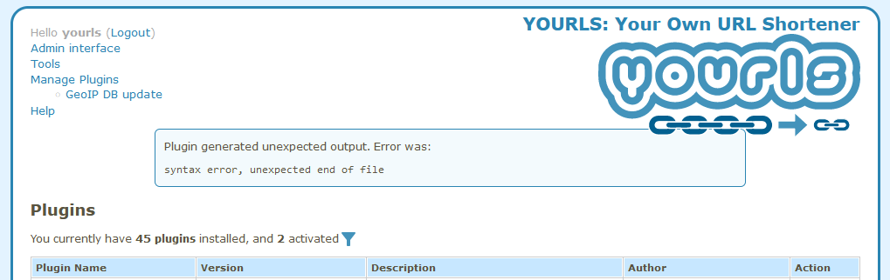
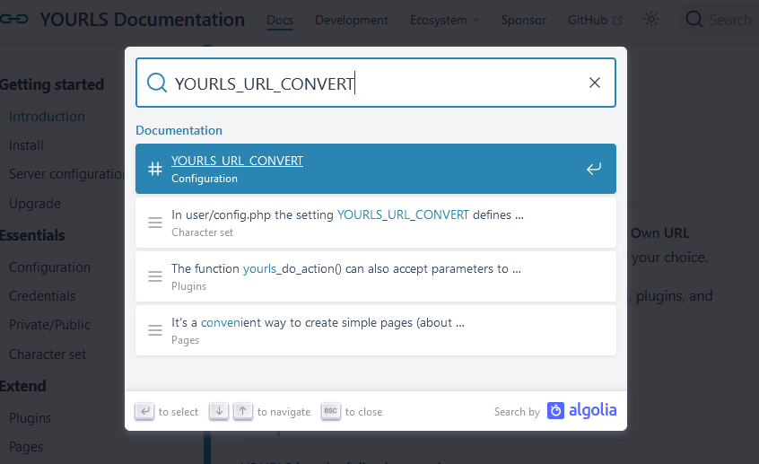

Hello everyone, I'm very excited to announce the release of [YOURLS 1.9](https://github.com/YOURLS/YOURLS/releases/tag/1.9) \\o/

<!--truncate-->

## Hail Adam « Nergal » Darski \\m/

In our tradition to name a new release after a metal vocalist, I'm dedicating 1.9 to Nergal, front man of Polish heavyweight extreme band [Behemoth](https://www.behemoth.pl/). Known for his magnetic charisma, insane energy and being a cancer survivor, Nergal also supports several worthy projects fighting censorship and promoting freedom of thought. I completely worship the man and suggest you relax to the sound of one of their [sweetest delicacies](https://www.youtube.com/watch?v=HKWqzjQAv14) 🙂

> Behemoth's Nergal - photo by [Per Ole Hagen](https://www.flickr.com/photos/peroleh/)

## Why so excited?

A lot of work went into that release and it's more than just _yet-another-release_. On the YOURLS core front, we have improved and fixed and worked on several things, such as:

- A true foolproof plugin sandbox: if a plugin you activate is PHP garbage with broken code, it won't break your whole install. Peace of mind! Also, there is now a proper (optional) uninstall procedure for plugins, see for instance the official [sample plugin](https://github.com/YOURLS/plugin-sample). We have other exciting news about plugins, more on this later.

> Broken plugin != broken YOURLS

- Improved security (mostly to prevent people from hacking themselves in creative ways, not gonna lie)
- Less annoying bugs, such as: there were sometimes irritating notices or unresponsive interface in particular cases when shortening or editing a URL; we now deal a lot better with concurrency requests when mass shortening URLs.
- Hardened test cases for better continuous integration, and implement smarter workflows in the repository.
  For instance, the GeoIP database is now regularly and automatically updated in GitHub. While that doesn't change much for users between releases, this really makes our maintainer life easier.
  (On this topic and for you users, I recently made a [GeoIP Update plugin](https://github.com/ozh/yourls-geoip-update), to easily update your GeoIP database if there has been no new YOURLS release in a while)

Note that YOURLS now requires **PHP 7.4** as a minimum, and is of course fully tested for PHP 8.0 and 8.1.

Those interested will find more boring details in the [CHANGELOG](https://github.com/YOURLS/YOURLS/blob/master/CHANGELOG.md) as usual.

I mentioned earlier "on the YOURLS core front": what else would there be on other fronts?

## Sweet documentation now on docs.yourls.org

The whole YOURLS documentation now lives at [docs.yourls.org](https://docs.yourls.org/) and boy this is neat. Powered by modern and lightning fast Vuepress, this documentation has two nice benefits for users:

- it's fully and efficiently searchable: the search box on the top right provides real time and accurate results about whatever you may be looking for:

- It's now easier than ever to propose enhancement for the documentation. Notice a typo? Want to suggest a better rewording, or even cover a whole new important topic we've overlooked? Simply click on "Edit this page" and file a regular pull request on [YOURLS/docs](https://github.com/YOURLS/docs).

## Plugin test suite!

This one is for plugin authors: we have released a convenient [Test Suite tool for plugins](https://github.com/YOURLS/YOURLS-test-suite-for-plugins), to make it easier to write and run unit tests for your plugins in a real YOURLS environment.

This is truly a new dawn for YOURLS plugin coders. The typical YOURLS plugin is a simple file with a couple filters and actions performing a simple task, and it's tempting to just forget about it. The [Test suite for plugins](https://github.com/YOURLS/YOURLS-test-suite-for-plugins) makes it easier to write tests, forget about your plugin AND be noticed if, for instance, a future YOURLS release breaks something!

Plugin authors: go ahead, play with the test suite, write some tests and earn the "test icon" 🧪 in the [Awesome YOURLS](https://github.com/YOURLS/awesome-yourls) list! Feel free to ping Ozh if you need some guidance to get started.

## Wrapping it up

[YOURLS 1.9 is out](https://github.com/YOURLS/YOURLS/releases/tag/1.9), right in time to celebrate our **8000th star** on GitHub.

Over the years YOURLS has been consistently in the [Top 100 PHP projects on GitHub](https://github.com/ozh/top_100_PHP_projects) and we are really humbled and honoured. From the bottom of our hearts, we're sending a warm thank you to every people using YOURLS in small personal projects or large corporate environment, to people writing plugins and providing materials that make a [vivid ecosystem](https://github.com/YOURLS/awesome-yourls), to people [financially supporting](https://docs.yourls.org/sponsor.html) the project, and to everyone telling the world about it!

Now it's time to do your part!

- [Update YOURLS](https://github.com/YOURLS/YOURLS/releases)! As usual, this would make a nice occasion for a little backup 😉
- Tweet about this release, make friends know about it and entice them to update
- Star us on GitHub if you haven't already 😉
- Plugin author? [Write some tests](https://github.com/YOURLS/YOURLS-test-suite-for-plugins/)!
- Translation maintainer? [Update your translation](https://github.com/YOURLS/YOURLS.pot)!

Peace on you!
