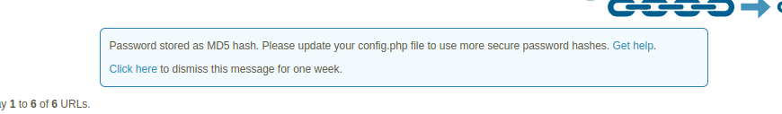

We've just released [YOURLS 1.10.5][the release page]!

[the release page]: https://github.com/YOURLS/YOURLS/releases/tag/1.10.5

<!--truncate-->

## What's new?

This update contains _a lot_ of miscellaneous security improvements and hardenings. Let's explain a few.

- **The MD5 algorithm has been entirely phased-out**, which was used in a few uncritical places,
  despite being deprecated since many years.

  For most users, updating YOURLS will simply log them out till they log back in.

  Those of you who explicitly decided to use MD5 to encrypt your password
  in your config file (something like `md5:12345:badc0ffeebadc0debadc0ffeebadc0de`) will be shown a
  friendly reminder to upgrade with a [helpful link](/docs/guide/essentials/credentials):

  

  It also means your API signature (found in `/admin/tools.php`) is now a _longer_ string. Users of the
  [Passwordless API](/docs/guide/advanced/passwordless-api) will need to update their signature to the new value.

- **The private IP shortening on public installs has been restricted**.

  If you are running a public YOURLS instance where
  anyone can shorten links, this means that from now on, anonymous users won't be able to retrieve the title of
  pages hosted on internal IPs (`192.168.1.10` and such). This change prevents malicious users from using YOURLS to
  scan IPs and ports, to discover services. YOURLS will continue to operate normally, but the short URL title will be
  simply `10.0.0.1:3128`, instead of `Sensitive MYSQL service` confirming its existence.

- **Many, many more unit tests were added**.

  Unit tests are automated tests running every time someone modifies the core code.
  They ensure that adding or modifying code and feature won't break something unforeseen. We're currently automatically
  checking that YOURLS runs fine under [PHP 8.1 to 8.6](https://github.com/YOURLS/YOURLS/actions/runs/32036967288),
  and the number of automated tests have simply _doubled_ over the last few months. This brings geek satisfaction to geeks,
  and peace of mind to end users :)

These are just the highlights; for more technical stuff see [the release page][] or our full [CHANGELOG](https://github.com/YOURLS/YOURLS/blob/master/CHANGELOG.md).

## Thanks to the community

We've had several people helping with this release, which is always a nice reminder that this project matters to people :)

User [@TowyTowy](https://github.com/TowyTowy) proposed a pull request that was merged ([#4133](https://github.com/YOURLS/YOURLS/pull/4133)).

Some people submitted security advisories (calls for enhancement or security fixes). We either accepted their report and fixed the
problem in YOURLS, or we closed it because we felt that it was out of YOURLS scope, but still considered parts of it to implement
enhancements. In no particular order, we would like to thank [@meifukun](https://github.com/meifukun), [@energytag6](https://github.com/energytag6),
[@web-hacker-team](https://github.com/web-hacker-team), [@tonghuaroot](https://github.com/tonghuaroot), [@5ud0er](https://github.com/5ud0er), and,
most likely, their Claude Code or equivalent LLM 😝

We've had also numerous people submitting duplicate reports, with clear signs that it was their Claude Code behind the
steering wheel. (We particularly liked the report with "GitHub username: insert your GitHub username".)

This is certainly an occasion to promote our [AI Policy](https://github.com/YOURLS/.github/blob/main/AI_POLICY.md): while
we do not disapprove the use of AI tools, we insist that they must remain, in our opinion, a help to humans and not replace
humans. In any case, there are humans here at the small YOURLS organization and our time is too scarce to deal with an
avalanche generated by AI :)

## How to update?

It's the typical case of "upload files over older ones and forget", which as always doesn't affect your plugins and user config.

Also as always, if it's been a while since your last DB backup, we suggest you do that **before** updating, since the new version will ask your database to change some stuff.

## Spread the word! <!-- markdownlint-disable-line MD026 -->

Help us make YOURLS bigger!
You can do your part by telling friends to update, by sharing this release on the Fediverse (mention @[YOURLS@fosstodon.org](https://fosstodon.org/@YOURLS)!),
and by [giving us a star on GitHub](https://github.com/YOURLS/YOURLS) 😉

Thank you all!
